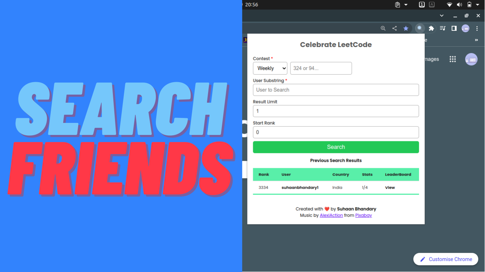
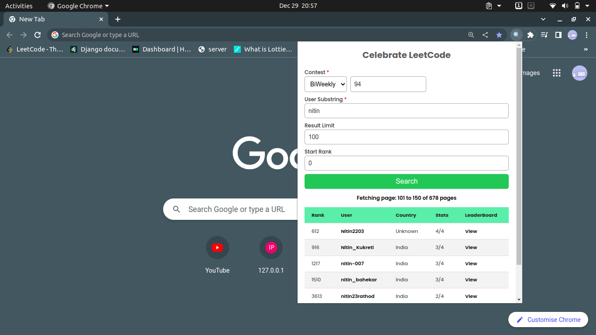
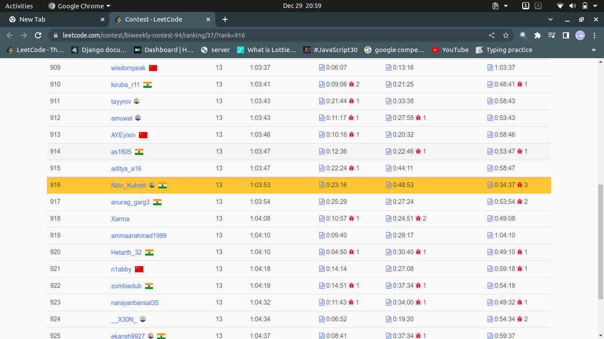

# Celebrate LeetCode

When your submission is accepted on LeetCode, this Extension helps to celebrate!
And you can also search friend's result for any LeetCode contest!!

As a fun project, I created this Extension based on a [post](https://www.linkedin.com/posts/ria-monga_sidhu-moose-wala-would-do-too-https-activity-7005049528282165248-fsBn?utm_source=share&utm_medium=member_desktop) by Ria Monga on Sunday. It took me four hours to create the project, and I had to submit it several times to get it to work!

## Run Locally

Clone the project

```bash
  git clone https://github.com/Suhaan-Bhandary/Celebrate-LeetCode.git
```

Open Chrome

- Click on Three dots
- More tools > Extension
- Turn on Developer Mode
- Click on "Load Unpacked"
- And Select the Project Folder

## Features

- Plays a Song on Every Accepted Solution
- Search friends in a contest and get their results
- No need to know the full username of your friend
- Displays result of any contest on LeetCode
- Results generated in 2 Mins
- Simple to use UI
- Open Source

## Screenshots

- Search you Friends!!


- Search Results


- Live Highlight on LeetCode


## Important to Note

- Audio Play on Submission only works on new LeetCode UI
- Only one type song is played: Need to add support for custom song

Stay tuned for more updates on this chrome extension, as I will be working on it in my free time

## Contributing

Contributions are always welcome!

## 🚀 About Me

I'm a Full stack developer, studying Computer Engineering in K. K. Wagh Institute Of Engineering Education And Research

## 🔗 Links

[](https://suhaan-bhandary.github.io/suhaan-portfolio/)
[](https://www.linkedin.com/in/suhaan-bhandary/)
